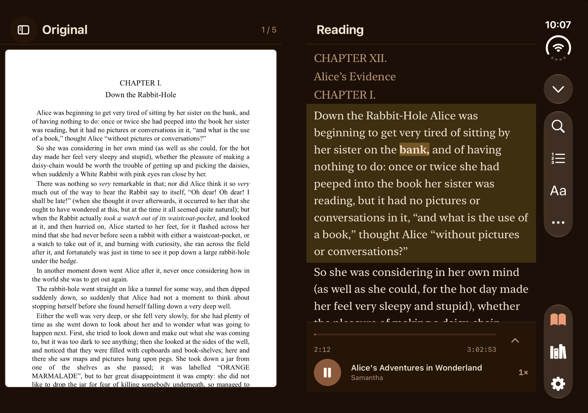
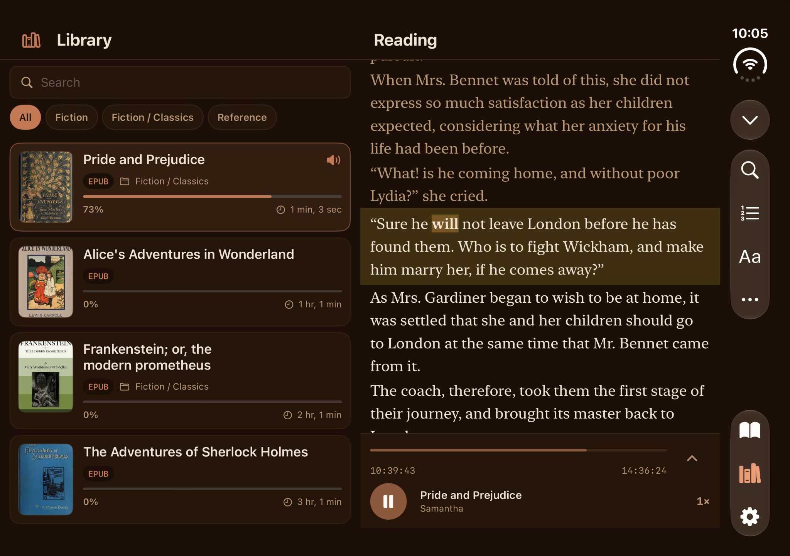

# ReadAloud for iPhone Duo

[ReadAloud on the App Store](https://apps.apple.com/app/id6765783837) · [商店页面](https://apps.apple.com/nz/app/id6765783837)

## A book you can read, hear, and keep your place in

ReadAloud pairs a document's original page with a spoken-text reading view. On iPhone Duo, the same task makes use of the device's changing shape: compare the page and the highlighted words while the inner display is open; set the phone down partially folded to read above a touch console; turn to the outer landscape display for a large, glanceable listening view. The Duo update is designed to keep the active document and playback state as the layout changes.

**The release distinction:** Original Layout is already in the live ReadAloud 1.8.0 app. This upcoming enhancement is the posture-aware reading and listening experience on iPhone Duo.

### Open like a book · original page beside spoken words

The source page stays visible as the reading view highlights the words being spoken. [Compare the flat expanded layout](assets/ui-inner-landscape-original-reading.png) and [its captured device window](assets/03-inner-landscape-original-reading.png).

### Browse while listening · library beside the active passage

The library remains available alongside the current text and playback controls, so choosing what to read next does not require leaving the listening surface.

### Set it down · reading above a touch console

The upper region is for reading; playback, speed, voice and sleep controls occupy the lower region. [The simulator device-window frame shows the visible fold](assets/04-inner-portrait-reading.png).

### Turn the outer screen toward you · listen at a glance

The outer landscape interface enlarges the passage and primary playback control. [See the device-window frame](assets/06-outer-landscape-reading.png). A front-facing screenshot does not establish the side profile of a physical Tent posture.

More captured layouts and source notes / 更多画面与素材来源

| Display | Captured simulator frame |
| --- | --- |
| Outer portrait | [Library](assets/01-outer-portrait-library.png) |
| Inner landscape | [Home](assets/02-inner-landscape-home.png) · [Library](assets/05-inner-landscape-library.png) |

The four large images above are unaltered screenshots from the running iPhone Duo simulator, supplied by the developer on September 24, 2026. The six device-window frames are selected and cropped from a separate continuous simulator recording; one outer landscape frame was rotated as a whole. No app UI, device, hinge or camera was generated or composited. Still images document layouts, not transition smoothness or retail hardware performance. iPhone Duo is not yet on sale.

## 中文说明

这是 ReadAloud 的 **iPhone Duo 姿态适配**展示：半折内屏将原文和高亮朗读文字放在两侧；横向内屏可一边查看书库一边继续朗读；桌面半折时上方阅读、下方操作；外屏横向则突出当前段落和主要播放按钮。原文布局已经在商店 1.8.0 版本上线，本次待发布的更新是这些随形态变化的布局。所有界面图来自真实模拟器截图，设备窗口图来自录屏，没有合成硬件；静态图不代表真机性能或折叠切换的流畅度。
