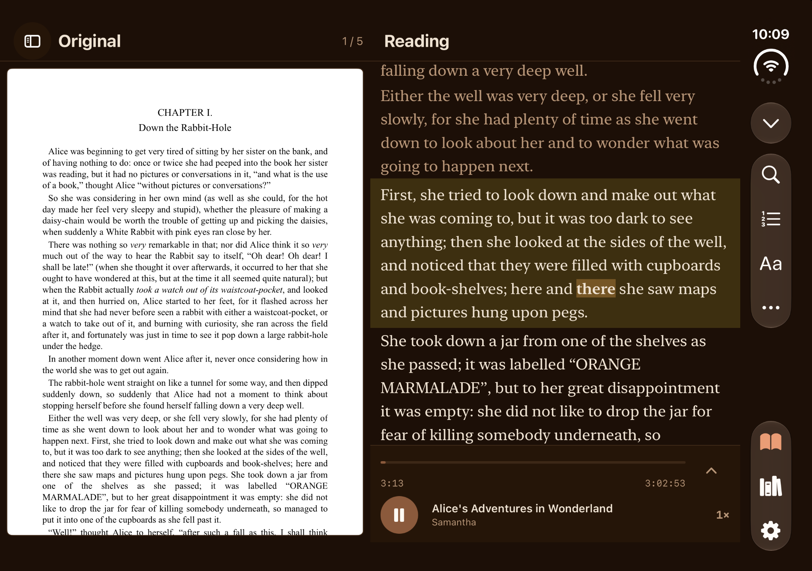
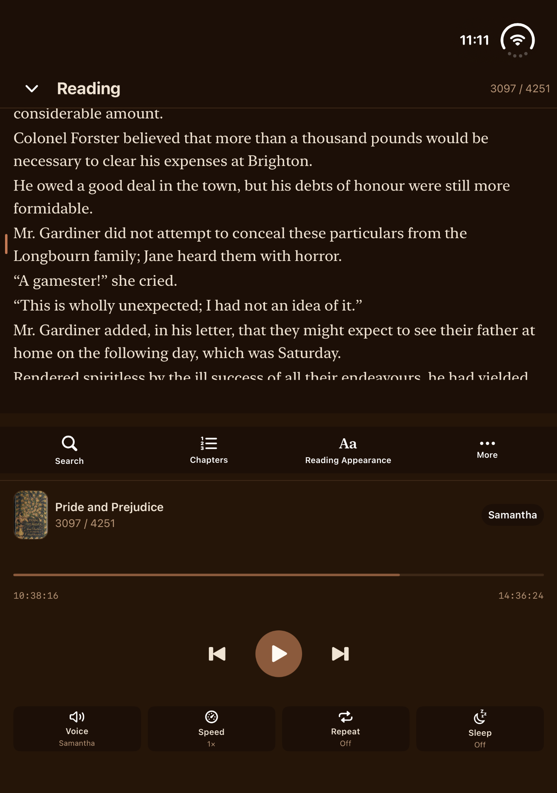
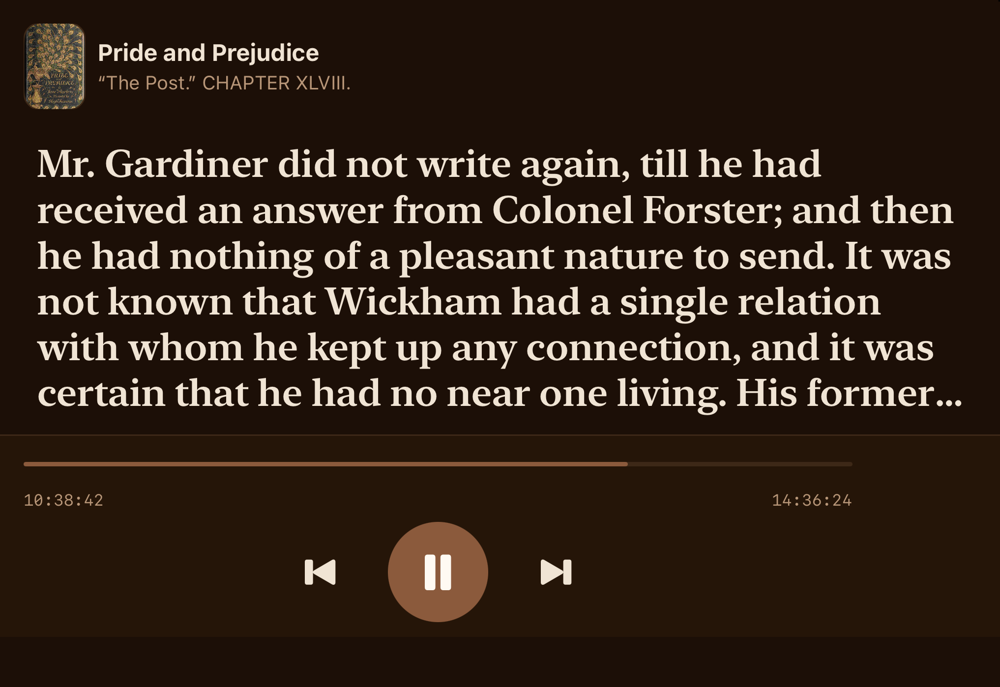

# ReadAloud for iPhone Duo

[Live app on the App Store](https://apps.apple.com/app/id6765783837) · [ReadAloud 商店页面](https://apps.apple.com/nz/app/id6765783837)

## One reading session, shaped to the device

ReadAloud lets people move between reading a document and listening to it. **Original Layout is already in the live 1.8.0 app.** The upcoming iPhone Duo enhancement is how that existing reading session uses each display and posture: the expanded display places the original page beside the spoken-text view; the partially folded display keeps text above the fold and the playback console below; the outer landscape display offers a large, simplified listening surface. The goal is to keep the document and playback position when the layout changes.

这次提名针对 **iPhone Duo 的适配更新**。原文布局已在现有 1.8.0 版本上线；新体验在于展开时并排阅读、半折时将正文与操作分置上下，以及外屏横向时使用更适合观看和操控的朗读界面。切换形态时，阅读任务应保持在原来的位置。

## What the running app shows / 实际界面

These are **unaltered, full-resolution simulator screenshots** supplied by the developer on September 24, 2026. They show the running app UI, without an invented device frame. The smaller device-window frames linked below were extracted from a separate, continuous simulator recording. A still frame does not establish the smoothness of a posture transition or the physical angle of the hinge.

以下原图为开发者在 2026 年 9 月 24 日提供的真实模拟器截图，未合成设备边框。文中另附从连续模拟器录屏中选出的设备窗口帧；静帧无法证明切换过程的流畅度或铰链的物理角度。

### Expanded inner display: the page beside the spoken text / 展开内屏：原文与朗读并排

The left pane preserves the source page. The right pane shows the reading view, highlighted speech and playback controls. [See the device-window frame](assets/03-inner-landscape-original-reading.png).

左侧保留原文页面，右侧显示朗读文字、当前高亮和播放操作。[查看带设备外观的录屏帧](assets/03-inner-landscape-original-reading.png)。

### Partially folded inner display: reading above, controls below / 半折内屏：上方阅读，下方操作

The app allocates the upper region to text and the lower region to playback. [See the recording frame with the visible device fold](assets/04-inner-portrait-reading.png). The raw UI screenshot alone does not show the physical bend.

上方展示文本，下方承载播放控制。[查看显示折线的设备窗口录屏帧](assets/04-inner-portrait-reading.png)。单独的原始截图无法呈现物理弯折。

### Outer landscape display: listening at a glance / 外屏横向：远距离可读的朗读界面

The current passage and transport controls fill the outer landscape display. [See the device-window frame](assets/06-outer-landscape-reading.png). This front-on view does **not** prove the side profile of a Tent posture.

当前段落和主要播放控制在外屏横向界面中占据主要空间。[查看设备窗口录屏帧](assets/06-outer-landscape-reading.png)。正面视角**不能**证明 Tent 姿态的侧面轮廓。

Other captured layouts / 其他真实录屏帧

| Display / 屏幕 | Captured layout / 所见界面 |
| --- | --- |
| Outer portrait / 外屏竖向 | [Library / 书库](assets/01-outer-portrait-library.png) |
| Inner landscape / 内屏横向 | [Read home / 首页](assets/02-inner-landscape-home.png) · [Library / 书库](assets/05-inner-landscape-library.png) |

All six linked device-window frames are from the same continuous simulator recording. They were selected and cropped; the outer landscape frame was rotated as a whole. No app interface, device, camera or hinge was generated or composited.

六张设备窗口图均来自同一段连续模拟器录屏，仅作选帧、裁剪，外屏横向帧整体转正。没有生成或拼接界面、设备、摄像头与铰链。

## Release and evidence / 版本与证据边界

The [live App Store version](https://apps.apple.com/nz/app/readaloud-text-to-speech-pdf/id6765783837) is 1.8.0 and already includes Original Layout. The Duo-specific layouts shown here belong to the forthcoming update. These simulator captures document the prelaunch layouts; they do not establish performance on retail hardware. iPhone Duo is not yet on sale, so this gallery does not require or claim a recording from a physical device.

当前商店版本为 1.8.0，已经包含原文布局；这里展示的是待发布的 Duo 专属布局。模拟器素材记录了上市前的界面，不能证明零售真机上的性能。iPhone Duo 尚未开售，本展示既不要求、也不声称包含真机录制素材。
