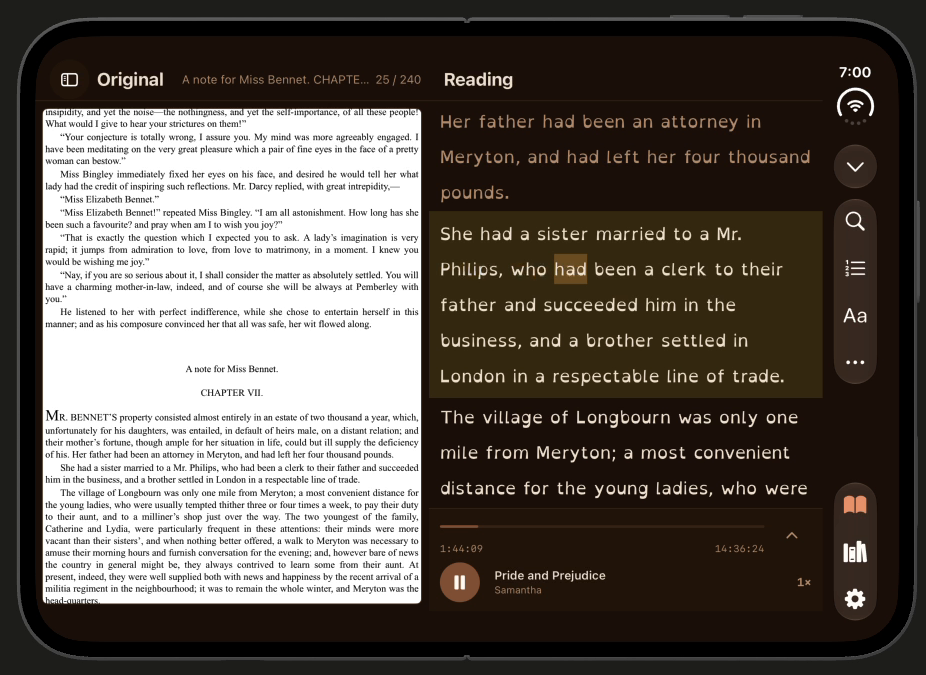
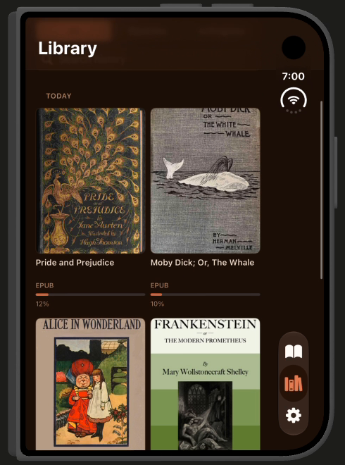
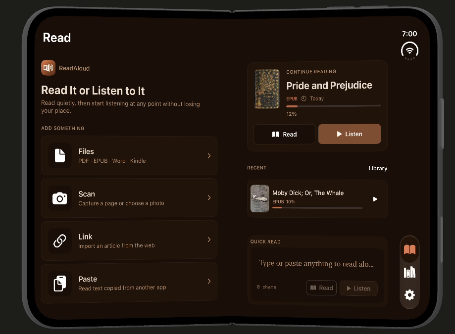
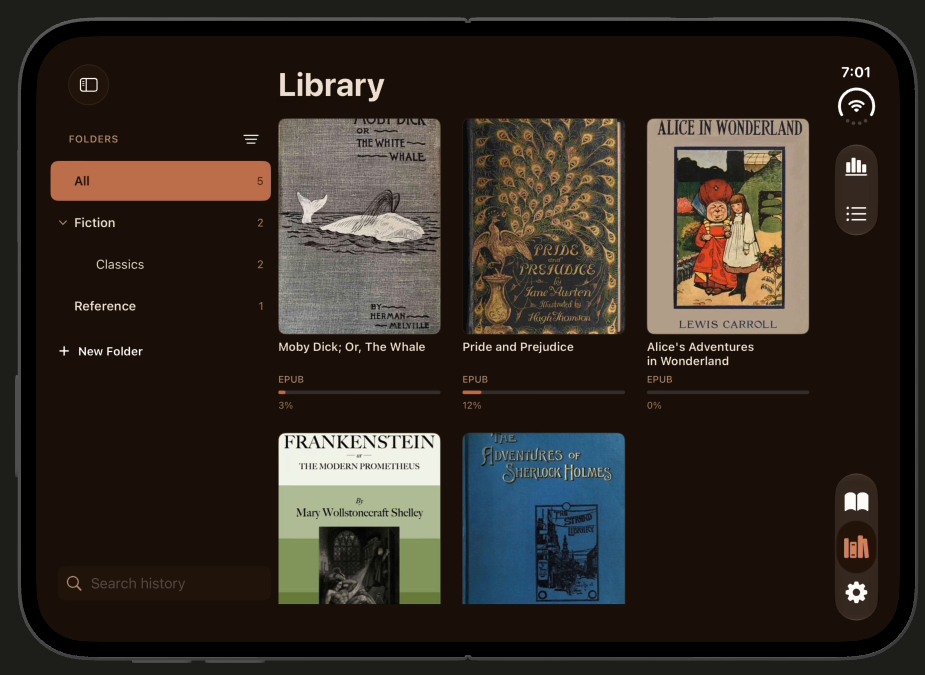
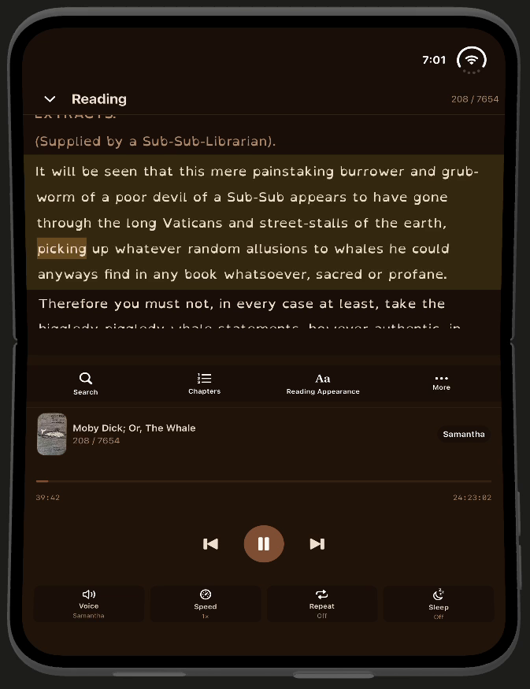
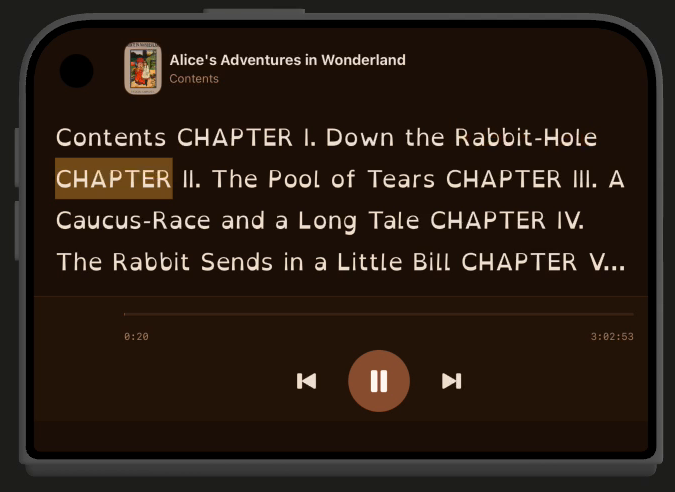

# ReadAloud · iPhone Duo

ReadAloud 可在外屏与内屏之间切换阅读和朗读界面。下图均直接截取自 2026-09-24 的 iPhone Duo 模拟器连续录屏，展示实际运行的 App 与模拟器设备外形。处理仅限选帧、裁去录屏的空白区域，以及把外屏横向画面整体旋转至正向；没有生成或拼接设备、铰链及 App 界面。鼠标没有进入这些成品画面。

_ReadAloud on iPhone Duo. These are frames from a continuous simulator recording of the running app. Frames were selected and cropped; the outer-display landscape frame was rotated as a whole. No generated or composited hardware or app UI is used._

## 原文与朗读并排 / Original and reading side by side

内屏横向展开后，原文与朗读文字同时显示，播放位置在阅读界面中可见。

## 不同屏幕与方向 / Screen layouts

### 外屏竖向 · 书库 / Outer portrait · Library

### 内屏横向 · 首页 / Inner landscape · Home

### 内屏横向 · 书库 / Inner landscape · Library

### 内屏半折 · 阅读与播放 / Partially folded inner display · Reading and playback

### 外屏横向 · 朗读 / Outer landscape · Listening

外屏横向帧只展示正面视角。该画面不能单独证明设备的 Tent 支撑形态；如果需要说明侧面折角，应使用能拍到侧面结构的素材。

_The outer landscape image shows the front view only. It does not establish the device's Tent geometry._
