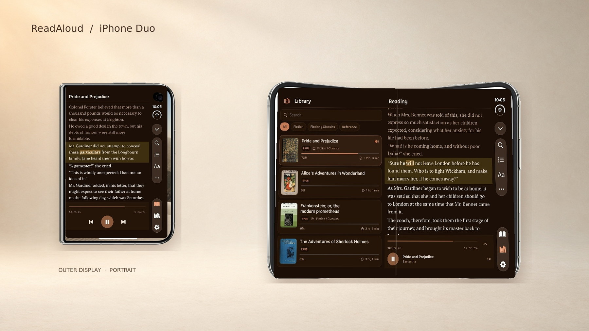
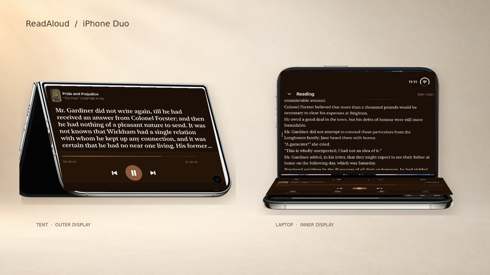

# ReadAloud on iPhone Duo

Visual material for App Store editorial consideration.

## Outer and inner displays

The board pairs the supplied simulator capture of portrait reading on the outer display with the inner landscape capture showing Library and Reading side by side.

## Tent and laptop postures

The board shows the supplied outer-display reading capture in Tent posture and the inner-display reading capture in laptop posture.

## Image sources and treatment

- Device bodies and postures are based on Apple’s published [iPhone Duo product imagery](https://www.apple.com/nz/iphone-duo/). Apple lists the open dimensions as 164.6 × 117.8 × 5.2 mm and the folded dimensions as 84.1 × 117.8 × 11.3 mm in its [technical specifications](https://www.apple.com/nz/iphone-duo/specs/).
- App screens are from the developer’s iPhone Duo simulator captures. They are resized and perspective-mapped onto the corresponding screen surfaces; the laptop capture is divided at the hinge. The app UI and text have not been redrawn.
- The background was generated separately. No device hardware or app interface was generated.
- These are editorial-context composites, not App Store screenshots.
